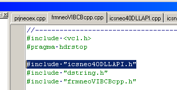
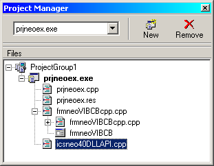
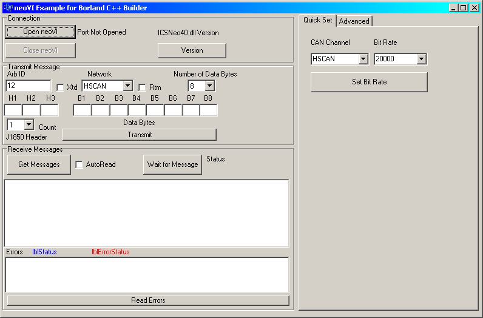

# Using the intrepidcs API in Borland C++ Builder - IntrepidCS API

**Do the following steps to use neoVI in Borland C++ Builder:**

1\) Start your new project and add the [Dynamic link helper files](https://cdn.intrepidcs.net/guides/neoVIDLL/\_downloads/d313052951efba4e15421be3f8e35682/DynamicLinkHelpCP.zip) to your project.

2\) Add a <span style={{color:'blue'}}>`#include`</span> "icsneo40DLLAPI.h" to your project

<div class="text--center">

<figure>



<figcaption>Figure 1 - include for “icsneo40DLLAPI.h”</figcaption>

</figure>
</div>

<div class="text--center">
<figure>



<figcaption>Figure 2 - “icsneo40DLLAPI.cpp” added to project</figcaption>
</figure>
</div>

3\) Use the Functions "LoadDLLAPI" to load the functions and "UnloadDLLAPI" to unload the functions. Examples are below.


```cpp
 //-----Load the DLL
 if(!LoadDLLAPI(hDLL))
 {
 //problem, close the application
 printf("Problem loading Library\r\nMake sure icsneo40.dll is installed and accessable\r\nPress any key to Exit");
 }

 //-----Unload the DLL
 UnloadDLLAPI(hDLL);
```

4\) Finally, call the methods as defined in the he [Basic Operation](./) document.

### **Example**

A Borland C++ Builder example (Figure 1) is included to show how the API all works together. The example files are included in the following file: [BCBneoVI.zip (31kB)](https://cdn.intrepidcs.net/guides/neoVIDLL/\_downloads/5b423931d746e01279d8219e71c2d219/BCBneoVI.zip)

The example shows how to open and close communication to the driver, send messages and read messages on the networks.

<div class="text--center">

<figure>



<figcaption>Figure 1 - The Borland C++ Builder Example.</figcaption>
</figure>
</div>