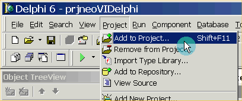
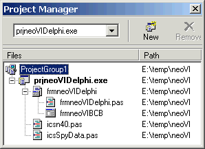
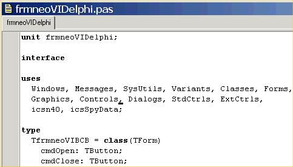
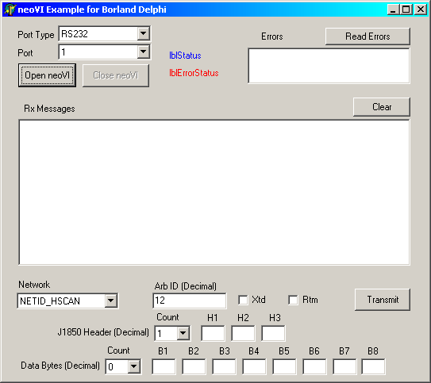

# Using the intrepidcs API in Delphi - intrepidcs API

**Do the following steps to use neoVI in Borland Delphi:**

1. Copy the import library [`icsn40.pas`](https://cdn.intrepidcs.net/guides/neoVIDLL/\_downloads/0a933d291562e4924f3c9d4703a9a1ff/icsn40.txt), and data structure file [`icsSpyData.pas`](https://cdn.intrepidcs.net/guides/neoVIDLL/\_downloads/f7a31ce4e3d1568164850c479ebab147/icsSpyData.txt) to your project directory.
2. Link to icsn40.pas import library via the “Add to Project…” option (Figure 1). This dialog is accessible via the “Project” pull down menu in Delphi. When the file dialog appears, select the icsn40.pas.

<figure>

<figcaption>Figure 1 - Add the Link to the “icsn40.pas”</figcaption>

</figure>

3\. Your project manager will now show the import library icsn40.pas (Figure 2).

<figure>

<figcaption>Figure 2 - The import library “icsn40.pas” is loaded.</figcaption>

</figure>

4\. Include icsn40 and icsSpyData in your interface Uses (Figure 3).

<figure>

<figcaption>Figure 3 - Adding to Interface Uses</figcaption>

</figure>

5\. Finally, call the methods as defined in the [Basic Operation](./) document.

### Example

A Borland Delphi example (Figure 1) is included to show how the API all works together. The example files are included in the following file: [`icsnDelphiSample.zip (14kB)`](https://cdn.intrepidcs.net/guides/neoVIDLL/\_downloads/43deb29626694ffd4d5145720cacdba4/icsnDelphiSample.zip)

The example shows how to open and close communication to the driver, send messages, and read messages on the networks.

<figure>

<figcaption>Figure 4 - The Borland Delphi Example.</figcaption>

</figure>

