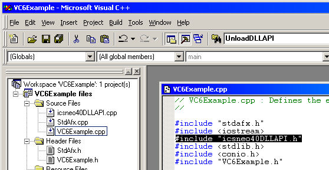

# Using the intrepidcs API in Visual C++ - intrepidcs API

### To use neoVI in Visual C++:

1. Start your new project and add the [Dynamic link helper files](https://cdn.intrepidcs.net/guides/neoVIDLL/\_downloads/d313052951efba4e15421be3f8e35682/DynamicLinkHelpCP.zip) to your project.

2. Add a <span style={{color:'blue'}}>`#include`</span> “icsneo40DLLAPI.h” to your project

<div class="text--center">

<figure>



<figcaption>Figure 1 - Link to the “icsnVC40.lib”</figcaption>

</figure>
</div>

3\. Use the Functions “LoadDLLAPI” to load the functions and “UnloadDLLAPI” to unload the functions. Examples are below.

```cpp
 HINSTANCE hDLL;

 //-----Load the DLL
 if(!LoadDLLAPI(hDLL))
 {
 //problem, close the application

 printf("Problem loading Library\r\nMake sure icsneo40.dll is installed and accessable\r\nPress any key to Exit");

 }

 //-----Unload the DLL

 UnloadDLLAPI(hDLL);
```

4\. Finally, call the methods as defined in the [Basic Operation](./) document.

A Visual C++ example (Figure 1) is included to show how the API all works together. The example files are included in the following file: [`VCNewneoVI.zip`](https://cdn.intrepidcs.net/guides/neoVIDLL/\_downloads/e0d42789bd4fbf6614f586c9bbb721da/VCNewneoVI.zip)

The example shows how to open and close communication to the driver, send messages and read messages on the networks.

<div class="text--center">

<figure>

.gif>)

<figcaption>Figure 2 - The Visual C++ Example.</figcaption>

</figure>

</div>