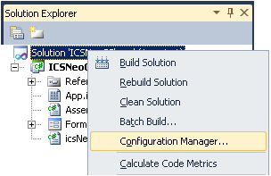
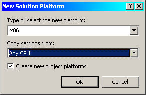
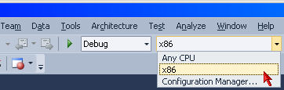

# Using the intrepidcs API in Visual Studio: 32 bit DLL and 64 bit OS - IntrepidCS API

Visual Studio 2005 and newer contain different options to compile an application. By default, new programs or programs upgraded from earlier versions of Visual Studio will be configured as "ANY CPU". This option will run as a 32 bit program (x86) on a 32 bit version of Windows and as a 64 bit program (x64) in a 64 bit version of Windows. Projects can also be directly specified as 32 bit (x86) or 64 bit (x64).

Starting with icsneo40.dll version 3.7.1.73 and newer, a 64 bit dll was introduced. Using software installs from Intrepid Control Systems, the two dlls are installed to their proper locations on the system. The compiler settings will dictate which of the two dlls is used. Windows will map to the proper one.

The folder location for the icsneo40.dll depends on the Windows install. On a 32 bit (x86) PC, just the 32 bit version is installed to the System32 folder. On a 64 bit system (x64) the 32 bit version is stored in the SysWoW64 folder and the 64 bit version is in the System32 folder. Again the operating system will take care of this based on your settings in the compiler. In either case, the application would need to reference System32, or not specify the location at all. Windows will search the application folder followed by the proper system folder locations to access the correct dll based on your compile options

The configuration manager is used to set which compile type needed. The following are steps for changing the compile options Visual Studio 2010. For help with your version and level of Visual Studio, consult Visual Studio help or [MSDN](http://www.msdn.com).

It is possible to change the compile options. The first step is to open the "Configuration Manager". This can be found by right clicking on your Solution and choosing "Configuration Manager" (figure 1).

<!--  -->

<figure>

<figcaption>Figure 1 - Configuration Manager can be   found in the Solution Explorer.</figcaption>

</figure>

Once in Configuration Manager, the Active solution platform can be selected. If you do not have the required option, select `<New...>` (figure 2).

<figure>

<figcaption>Figure 2 - Configuration Manager</figcaption>

</figure>

After a new Platform has be created, it can be selected from the Standard tool bar (figure 4)

<figure>

<figcaption>Figure 3 - Creating a new Platform</figcaption>

</figure>

<figure>

<figcaption>Figure 4 - Standard Tool bar selecting platform</figcaption>
</figure>

